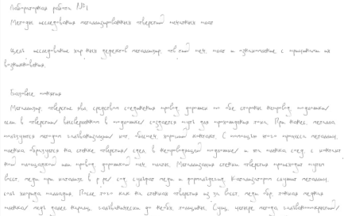
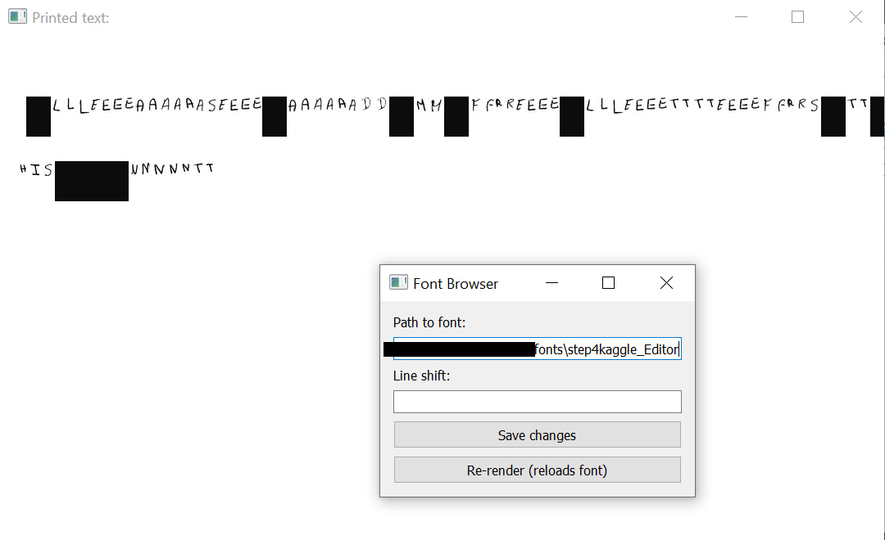
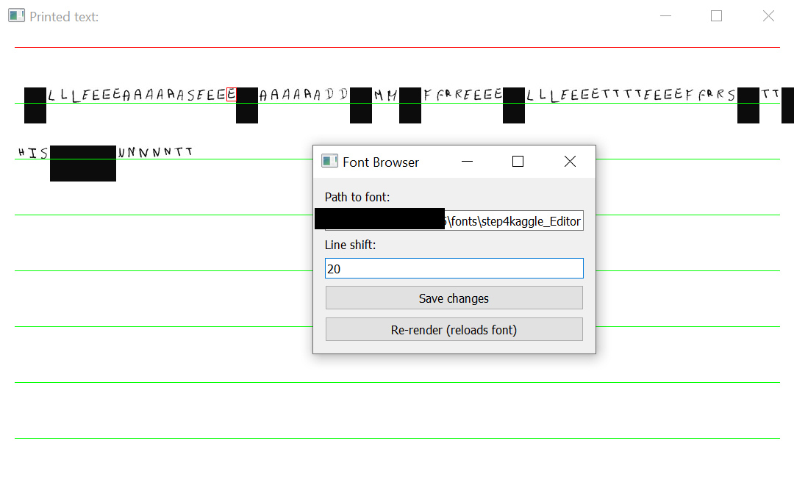
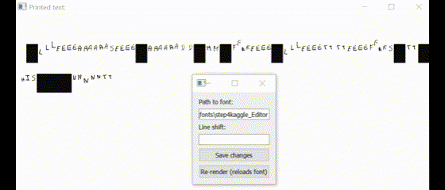

# Educational Archive for "wristsaver v5.5"

*Please note, that this project is obsolete, and is no longer maintained. No additional documentation will be released. No additional installation support will be provided*.

*Please note, that user font creation process, demonstrated in this readme file, is an extremely unpractical and tedious endeavor. The modern version of this project is available at the following address: [GitHub repository](https://github.com/gggrv/wristsaver_append)*.


## What is This

| Item | Description |
| ------------- | ------------- |
| What is this? | A project, saved into `git` repository, hosted at `GitHub` website. |
| What does it contain? | <ul><li>Several `python` tools for printing handwritten documents.</li><li>Minimal demo pseudofont, purely for demonstration purposes, not suitable for actual document printing.</li></ul> |
| Whom is this for? | For beginner python developers. |
| What is the current project status? | Archived, obsolete, no longer maintained. |
| Why is it obsolete? | <ul><li>The code is unnecessarily obscure and rigid --- introducing any meaningful changes would require complete project restructuring.</li><li>User font creation is complex and, taking into account the possibilities of modern Machine Learning tools, requires a prohibitive amount of manual labor.</li></ul> |
| What is the purpose of this repository? | Host an educational archive with working code. |
| Why is it named like that? | Because at one point in time it allowed to save several human wrists from unnecessary injuries. |

## Installation

For the best experience, please use the `Spyder` python IDE. It can be installed via `pip install spyder` command.

<ol>
<li>Clone this repository in a directory of choice.</li>
<li>Navigate to this directory.</li>
<li>Follow <a href="https://medium.com/analytics-vidhya/5-steps-setup-python-virtual-environment-in-spyder-ide-da151bafa337">this manual</a> in order to:<ol><li>Create the virtual environment</li><li>Activate this virtual environment</li><li>Make the <code>Spyder</code> work in this virtual environment.</li></ol></li>
<li>Install the specific dependency versions, listed in <code>requirements.txt</code>, into this virtual environment.</li>
<li>In <code>Spyder</code>, open the menu option "Projects"->"New Project...", select "Existing directory", set "Location" to the dir of the cloned repository and click "Create".</li>
<li>Open the menu option "Tools"->"Preferences", select "Run", set "Working directory settings" to "The current working directory" option.</li>
<li>Make sure that current working dir is the cloned repository dir.</li>
</ol>

## How to print a handwritten document

1. Open the `step5_Printer.py` file with `Spyder`.
2. Scroll to the bottom.
3. Adjust the `my_font_folder` variable.
3. Choose the menu option "Run"->"Run".

The `.png` images, named consequtively `1.png`, `2.png`, `3.png`... (their number depends on the amount of text being printed and user font size) will start appearing in the cloned repository folder. The user may want to manually post-process them via any available image editor.

The example output with a fine-tuned font could be as follows (*please note that for privacy reasons the original output image, which was 2480x3500px and 300 dpi resolution, had to be severely scaled down*):



### Customize the text that will be printed

1. Open the `giant_lecture.html` file.
2. Carefully edit its contents (make sure all tags are closed, etc).
3. Keep the tag structure as simple as possible --- only headers, paragraphs and new lines are recognized. <sub>Probably. I don't remember.</sub>

*Please note, that theoretically `wristsaver` can print in any language --- any letter, number, text symbol, emoji, pictogram, word, phrase, anything. In order to achieve this in practice, the user needs to manually add each desired custom item into his font and provide appropriate metadata. The process will be described in further sections.*

### Customize output image size, resolution, etc

1. Open the `main.css` file.
2. Carefully edit its contents (make sure all tags are closed, etc).
3. Keep the values as simple as possible.

## How to create a user font

For demonstration purposes, a minimal demo font is included at all development stages --- from `raw` to `printable`. The contents of this font are sampled from the freely available Kaggle handwriting dataset, available at the [official website](https://www.kaggle.com/datasets/landlord/handwriting-recognition?resource=download).

Please see the expected folder structure (some files are omitted):

```
■ cloned repository directory
├─■ fonts (root folder for all fonts)
│ ├─■ step0_raw_kaggle_test_images.zip
│ ├─■ step1_manually_split_kaggle_test_letters.zip
│ ├─■ step2kaggle_rem_bg_create_df.zip
│ ├─■ step3kaggle_write_image_width_and_height_to_df.zip
│ └─■ step4kaggle_Editor (folder with actual printable font)
├─■ step2_rem_bg_create_df.py
├─■ step3_write_image_width_and_height_to_df.py
├─■ step4_Editor.py
├─■ step5_Printer.py (already explained in the previous seciton)
└─■ step10_Marker.py
```

### Step 0 --- Obtain Raw Image with Handwriting

1. Scan a page with some handwritten text on it.
2. Create a folder `fonts/my_font_0raw`.
3. Put *a disposable copy* of the scanned image into the folder.

### Step 1 --- Split This Image Into Desired Fragments

*Please note, that the desired fragments can have any shape or size --- no restriction. Any differences will be mitigated via metadata editing tool in Step 4.*

Let's say that during `Step 0` the user has obtained `raw.png` image. Let's assume that this `raw.png` contains the following handwritten text: `The weather is good 100% :D`. Let's assume that the user wants to extract the following sub-images from this big `raw.png`:
- The image, containing word `The`
- The images for each individual letter (`T`,`h`,`e`,` `,`w`,`e`,`a`,`t`,`h`,`e`,`r`,` `,`i`,`s`,` `,`g`,`o`,`o`,`d`,` `,`1`,`0`,`0`,`%`,` `,`:`,`D`)
- The image, containing the frequenty-used number `100`
- The image, containing the smile `:D`.

The means to achieve this are entirely up to the user. Worst-case scenario is manual image editing: select desired region, save it to disk.

So, let's assume that at this moment the user has a lot of small images that contain the desired extracts from the big `raw.png`.

1. Create a folder `fonts/my_font_1split`.
2. Create a folder `fonts/my_font_1split/letters_lowercase`.
2. Create a folder `fonts/my_font_1split/letters_uppercase`.
2. Create a folder `fonts/my_font_1split/numbers`.
2. Create a folder `fonts/my_font_1split/my_custom_category`.
2. Create a folder `fonts/my_font_1split/it_can_be_named_anything`.
2. Put *disposable copies* of some of the small images into the appropriate subfolders.

*Please note, that the small images can be placed anywhere --- in root `fonts/my_font_1split`, in some user-defined subfolder. The target image location is entirely up to the user.*

### Step 2 --- Remove Backgrounds and Create Metadata

1. Duplicate the folder `fonts/my_font_1split`.
1. Rename it to be `fonts/my_font_2metadata`.
1. Open the `step2_rem_bg_create_df.py` file with `Spyder`.
2. Scroll to the bottom.
3. Adjust the `folder_with_letter_images` variable to the `fonts/my_font_2metadata`.
4. Choose the menu option "Run"->"Run".

The images in the `fonts/my_font_2metadata` folder will be edited inplace --- their background will become transparent. Additionally, `df.xls` files will be created.

### Step 3 --- Automatically Get Some Metadata

1. Duplicate the folder `fonts/my_font_2metadata`.
1. Rename it to be `fonts/my_font_3metadata`.
1. Open the `step3_write_image_width_and_height_to_df.py` file with `Spyder`.
2. Scroll to the bottom.
3. Adjust the `folder_with_letter_images` variable to the `fonts/my_font_3metadata`.
4. Choose the menu option "Run"->"Run".

The `df.xls` files will be edited inplace.

### Step 3.3 --- Add Text Labels to Metadata

1. Duplicate the folder `fonts/my_font_3metadata`.
1. Rename it to be `fonts/my_font_printable`.
1. Open one `df.xls` in this folder with any supported editor.
2. Add new column named `text`.
3. Input the desired text (example: `t_uppercase.png` has text `T`, `a_version_slanted.png` has text `a`, `1.png` has text `1`, `smiley_face.png` has text `😊`, `word_the.png` has text `^`).

*Please note that only one-character symbols are supported. <sub>Probably. I don't remember.</sub>*

At this moment in time the font is officially usable: it has enouh metadata. The printed results will most likely be odd --- letter spacing is incorrect, tall images are placed wrong, etc.

### Step 4 --- Adjust Metadata via GUI Editor

1. Open the `step4_Editor.py` file with `Spyder`.
2. Scroll to the bottom.
3. Adjust the `my_font_folder` variable.
4. Choose the menu option "Run"->"Run".
5. Two `GUI windows` will show up:



6. Click on any letter in the `GUI window with letters`.
7. The letter will become highlighted by red border, and the lines will appear:



8. Use `W`,`A`,`S`,`D` to adjust the letter's position relative to its neighbouring letters.
9. When satisfied, press `ENTER`
10. In the `Font Browser` GUI window press the `Save changes` button.
11. In the `Font Browser` GUI window press the `Re-render` button.



After this, attempt to print the document via `step5_Printer.py` again, and see if the results are better.

## License

The actual licenses are available per-flie, please see the source code. The `GUI` elements that rely on the `PyQt5` library are subject to GPL v3.  
Any unmarked file is implied to be subject to Apache 2.0.
